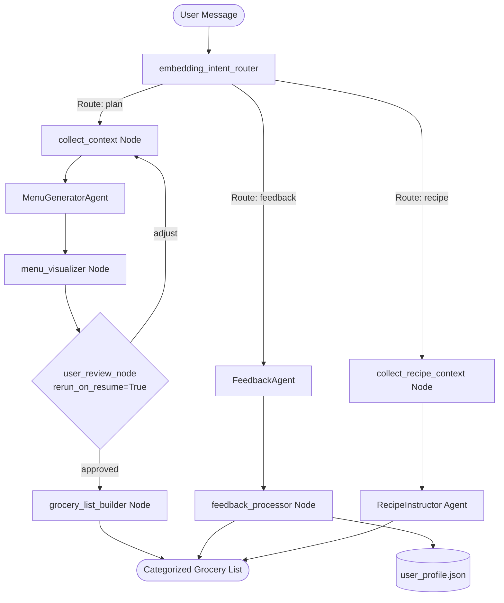

# Meal Concierge Multi-Agent: AI-Powered Family Meal & Schedule Concierge

## 1. Project Overview & Problem Statement
Planning weekly family meals is a time-consuming chore that requires balancing multiple shifting constraints:
* **Busy Family Calendars**: Coordinating dinner times around late work schedules, children's sports practices, or changing daily headcounts.
* **Varying Weather Conditions**: Adapting cooking styles (e.g., grilling vs. baking) based on real-time weather forecasts.
* **Dietary Restrictions & Picky Eaters**: Ensuring allergens (e.g., shellfish) are strictly avoided while respecting family dislikes (e.g., mushrooms).
* **Long-Term Memory**: Keeping track of favorite family recipes so they can be rotated into the plan automatically.
* **Shopping Friction**: Translating a meal plan into a minimal grocery list by subtracting ingredients already present in the pantry.

**Meal Concierge Multi-Agent** solves this by leveraging the **Google Agent Development Kit (ADK 2.0)** to coordinate a graph-based workflow of LLM agents, semantic routers, database memory, and API tools into a single cohesive, interactive multi-agent system.

---

## 2. System Architecture (Multi-Agent Workflow)
The system is built as a stateful graph-based workflow utilizing ADK 2.0's `@node` decorators, coordinating multiple specialized agents.

### Specialized Agents & Components:
1. **`embedding_intent_router` (Semantic Router)**: Uses text embedding similarity (with fallback keyword matching) to route inputs to the planning flow (`plan`), feedback/rating flow (`feedback`), or recipe instruction flow (`recipe`).
2. **`collect_context` (Tool Integrator)**: Synthesizes input by querying family calendar events, weather forecasts, refrigerator/pantry inventory, and long-term favorites rotation.
3. **`MenuGeneratorAgent` (Core LlmAgent)**: Formulates a structured 7-day weekly menu that satisfies all dietary, schedule, and cooking constraints.
4. **`menu_visualizer` (Visualizer Node)**: Calls the **Gemini 3.1 Flash Image** model to generate and display a beautiful food photography collage of the menu inline.
5. **`user_review_node` (Human-in-the-Loop Interrupt)**: Stops execution to await user approval. If adjusted (e.g., *"Change Wednesday to pasta"*), it routes back to regenerate only the requested day, preserving all other days.
6. **`grocery_list_builder` (Pantry Subtractor & Cost Estimator)**: Compiles required ingredients, subtracts current pantry quantities, and calculates the total estimated cost of the weekly grocery list using mock prices.
7. **`FeedbackAgent` & `feedback_processor` (Memory Agents)**: Analyzes recipe ratings, extracts positive/negative sentiment, and updates the local favorites profile (`user_profile.json`).
8. **`collect_recipe_context` & `RecipeInstructor` (Recipe Agents)**: Identifies which meal the user is asking about from the active session menu, and generates detailed step-by-step cooking instructions, prep times, and chef tips.

---

## 3. Key Concepts & Innovations Applied

### A. True Multi-Agent Collaboration
Instead of a single monolithic prompt, the system delegates tasks to specialized agents: `MenuGeneratorAgent` (planning), `FeedbackAgent` (memory), `RecipeInstructor` (cooking instructions), and `menu_visualizer` (imagery). This separation of concerns improves reliability, reduces prompt complexity, and allows for independent scaling.

### B. Multi-Model Strategy (Optimized Quota Routing)
To prevent quota errors and rate limiting, the architecture is divided into three isolated model pools:
* **Pool 1 (Semantic Router)**: Utilizes embedding models (`gemini-embedding-1` / `text-embedding-004`) to handle intent classification at a fraction of the cost and high limits.
* **Pool 2 (Image Generator)**: Employs **Gemini 3.1 Flash Image** for high-quality food visuals, integrated seamlessly into the pipeline.
* **Pool 3 (Main Agents)**: Utilizes a custom **`FallbackGemini` model rotation chain** (`gemini-3.5-flash` → `gemini-3.1-flash-lite` → `gemini-2.5-flash-lite` → `gemini-3-flash-preview` → `gemini-2.0-flash-lite` → `gemini-2.0-flash`) that automatically switches models on `429`, `503`, or `404` errors with a 20-second timeout.

### C. Stateful Resumability & Precise Adjustment (HITL)
* Utilizes `ResumabilityConfig(enabled=True)` and `@node(rerun_on_resume=True)` to halt workflow execution during user reviews.
* Tracks a `review_count` to assign unique interrupt IDs.
* Remembers the previously generated menu state so that user adjustments only regenerate the targeted days, avoiding full-menu regenerations and saving tokens.

### D. Persistent Long-term Memory
* Integrates a local JSON storage (`user_profile.json`) representing the family's profile.
* Converts unstructured positive/negative ratings dynamically into structured favorite items and writes them to the JSON store, ensuring personalization persists across sessions.

---

## 4. Evaluation & Verification

### Automated Test Suite
We implemented a robust unit and integration test suite using `pytest` verifying:
* Weather, calendar, and pantry tool output parsing.
* Schema mapping between LLM outputs and favorites storage format.
* Intent router classification.
* End-to-end workflow execution, including pausing at user review and resuming with approval to yield grocery lists.
* **Command to run**: `uv run pytest tests/unit`

### Evaluation Configurations
* Synthesis dataset located at `tests/eval/datasets/basic-dataset.json`.
* Quality grading rules configured in `tests/eval/eval_config.yaml` to score constraint adherence (e.g., no shellfish, grill style matches sunny weather, correct grocery quantities).
