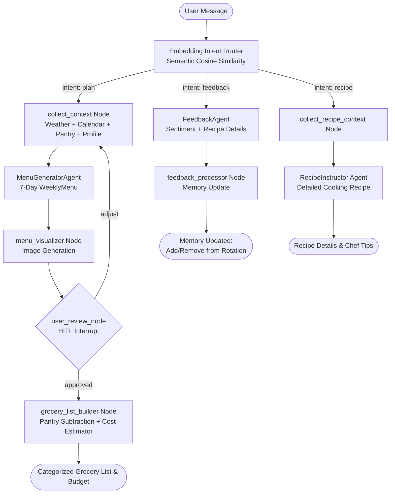

# 🍽️ Meal Concierge Multi-Agent: Family Meal & Schedule Concierge

**Meal Concierge Multi-Agent** is an AI-powered personal assistant built using **Google Agent Development Kit (ADK 2.0)**. It automates weekly meal planning and grocery shopping by intelligently balancing calendars, weather forecasts, family preferences, and long-term memory.

---

## 📖 Table of Contents
1. [Core Features](#-core-features)
2. [Architecture Overview](#️-architecture-overview)
3. [Workflow Graph](#-workflow-graph)
4. [Project Directory Structure](#-project-directory-structure)
5. [Prerequisites](#-prerequisites)
6. [Installation & Setup](#-installation--setup)
7. [Usage Guide](#-usage-guide)
8. [Testing & Quality Verification](#-testing--quality-verification)
9. [Changelog](#-changelog)

---

## ✨ Core Features

* **Schedules & Weather Integration**: Reads parent work events, children's sports (late dinners), and joint-custody schedules (daily headcount). Analyzes weather forecasts to determine if outdoor grilling is possible.
* **Dietary Preferences & Picky Eaters**: Automatically ignores forbidden ingredients (like shellfish or seafood) and avoids foods family members dislike.
* **Long-Term Memory Rotation**: Reads and writes favorite recipe rotations to a persistent local JSON configuration (`user_profile.json`).
* **Interactive Approval Loop (HITL)**: Proposes a menu first and allows the user to suggest adjustments or revisions before approving. Adjustments modify **only the specific requested days**, keeping all other days unchanged.
* **Smart Grocery List & Cost Estimator**: Compiles required ingredients, subtracts quantities already in the pantry/fridge, computes a categorized list, and estimates the total budget using mock prices.
* **Semantic Routing**: Uses semantic vector similarity to classify user intent as `plan`, `feedback`, or `recipe` — understanding natural phrasing and multilingual inputs.
* **Cooking Recipe Instructor**: Provides step-by-step cooking preparation, ingredient amounts, instructions, and chef tips for any meal on the menu.
* **Automatic Model Fallback**: Features a robust fallback mechanism that automatically rotates through alternative models in sequence if the primary model is unavailable.
* **Visual Menu Preview**: After generating the weekly menu, automatically creates a beautiful food photography collage image displayed inline in the chat before asking for approval.

---

## 🗺️ Architecture Overview

The system is designed as a modular multi-agent workflow leveraging Google Agent Development Kit (ADK 2.0). It operates on a stateful graph where specialized nodes execute specific tasks:

1. **Semantic Routing Layer**: Routes incoming queries to the meal planning flow, the memory feedback processor, or the recipe instructor based on semantic text embedding similarity.
2. **Context Aggregator**: Collects and parses calendar schedules, weather forecasts, inventory counts, and user preference profiles.
3. **Core Planner Agent**: Generates a structured 7-day meal plan conforming to all constraints.
4. **Visualizer Node**: Integrates with a text-to-image API to output a representative food photography collage for the proposed menu.
5. **Human-in-the-Loop Review Node**: Pauses the graph execution, allowing users to request targeted adjustments (e.g. changing Wednesday's dinner) without regenerating the entire plan.
6. **Smart Grocery Compiler & Cost Estimator**: Analyzes the approved plan, compares it to current pantry inventory, outputs a final shopping list, and calculates the total estimated budget using mock prices.
7. **Long-Term Memory Agent**: Analyzes recipe sentiment to add or remove favorite recipes from the persistent family profile.
8. **Cooking Recipe Instructor Agent**: Identifies which meal the user is asking about from the active session menu and generates full recipe details, prep steps, and cooking tips.

### Robustness & Performance
* **Separated Resource Pools**: High-frequency semantic routing is kept separate from heavy generation tasks to optimize resource limits.
* **Automatic Fallback Chain**: Main agents are backed by a fallback sequence that automatically rotates through available text models in case of network timeouts or resource limits.

---

## 🔄 Workflow Graph



### Menu Adjustment Flow (HITL Loop)

When user types an adjustment (e.g. `"Change Wednesday to pasta"`):

```
user_review_node
    │
    ├─ saves adjustment text + current menu → state
    │
    └─ routes back to collect_context
                │
                ↓
        collect_context reads:
          - adjustments: "Change Wednesday to pasta"
          - previous_menu: [full 7-day menu from state]
                │
                ↓
        MenuGeneratorAgent receives BOTH
          → ONLY replaces Wednesday
          → Keeps all other 6 days identical to previous_menu
```

---

## 📂 Project Directory Structure

```
meal-concierge-agent/
├── app/
│   ├── __init__.py        # App exports
│   ├── agent.py           # ADK 2.0 workflow graph, nodes, and LLM agents
│   │                      #   - FallbackGemini class (auto model rotation)
│   │                      #   - Embedding-based semantic router
│   │                      #   - WeeklyContext + previous_menu for precise adjustments
│   ├── tools.py           # Calendar, Weather, and Pantry mock tools
│   ├── memory.py          # Long-term preference profile loader/saver
│   ├── user_profile.json  # Persistent JSON memory file (ignored by Git)
│   └── main.py            # CLI entry point (with HITL approval loop)
├── tests/
│   ├── unit/
│   │   ├── test_agent.py          # Unit tests for mock tools and subtraction logic
│   │   └── test_workflow_integration.py  # Integration tests for full workflow
│   └── eval/
│       ├── eval_config.yaml       # Quality evaluation settings
│       └── datasets/
│           └── basic-dataset.json # Evaluation dataset prompts
├── pyproject.toml         # Dependencies & project metadata
└── README.md              # Project documentation (this file)
```

---

## ⚡ Prerequisites

Before setting up, ensure you have:
* **Python 3.11** or higher.
* **uv**: Fast Python packaging tool. Install via:
  ```bash
  curl -LsSf https://astral.sh/uv/install.sh | sh
  ```

---

## 🚀 Installation & Setup

Follow these steps to set up the virtual environment and install all dependencies:

### 1. Navigate to the project directory
```bash
cd 5-days-ai-agent/capstone_project/meal-concierge-agent
```

### 2. Create the virtual environment using `uv`
Create a `.venv` folder in your project root using Python 3.11:
```bash
uv venv --python 3.11
```

### 3. Activate the virtual environment
* **On macOS/Linux:**
  ```bash
  source .venv/bin/activate
  ```
* **On Windows:**
  ```cmd
  .venv\Scripts\activate
  ```

### 4. Install dependencies
Install all the required libraries (including ADK 2.0 and evaluation dependencies) directly into the environment:
```bash
uv sync --extra eval
```

### 5. Export API Keys
Export your API keys so they are accessible to the project.
* **Gemini API Key** (Required for routing and main agents):
  ```bash
  export GEMINI_API_KEY="your_gemini_api_key_here"
  ```
* **OpenAI API Key** (Required for DALL-E 3 image generation):
  ```bash
  export OPENAI_API_KEY="your_openai_api_key_here"
  ```

---

## 💻 Usage Guide

You can run the agent either through the graphical **ADK Playground** or in your terminal via the **Interactive CLI**.

### Option A: Run the ADK Playground (Recommended)
The Playground offers a beautiful chat interface where you can see generated meal images and interact with the Human-in-the-Loop widget.

1. Ensure your virtual environment is active.
2. Launch the playground server:
   ```bash
   uv run agents-cli playground --port 8080
   ```
3. Open [http://127.0.0.1:8080](http://127.0.0.1:8080) in your browser and select the **app**.

> ⚠️ **Important**: When the workflow pauses for review (`user_review_node`), type your adjustment into the **small `Enter your response...` box** inside the HITL widget (not the main chat input bar at the bottom).

### Option B: Run the Interactive CLI
To interact with the agent directly inside the terminal:
```bash
uv run python app/main.py
```

### Test Scenarios

#### Scenario A — Meal Planning
1. Type: `Plan my weekly meals please.`
2. Wait for the 7-day menu proposal and DALL-E 3 image preview.
3. In the approval/HITL widget, type: `Change Wednesday to pasta`
4. The system will regenerate **only** Wednesday's meal, keeping the rest intact.
5. Type `yes` to approve → view the final categorized grocery list.

#### Scenario B — Recipe Feedback (Positive)
Type any of these in the chat:
```
We loved the Spaghetti Bolognese last night!
The grilled chicken was amazing, please save it to favorites.
```
Expected: `[Memory Update] Added 'X' to your family favorites rotation.`

#### Scenario C — Recipe Feedback (Negative)
```
I hated the pizza, it was way too greasy.
The fish dish was terrible, please remove it.
```
Expected: `[Memory Update] Removed 'X' from your family favorites rotation.`

> 💡 The Embedding Router uses semantic vector similarity to route your feedback correctly without requiring strict keywords!

---

## 🛠️ Testing & Quality Verification

### Run Unit Tests (`pytest`)
```bash
uv run pytest tests/unit/
```

### Run Systematic LLM Evaluations
```bash
uv run agents-cli eval run
```
Runs scenarios in `basic-dataset.json`, grades trace outcomes, and generates scores based on constraint adherence rules in `eval_config.yaml`.

---

## 📝 Changelog

### v2.0.0 — June 2026 (Current)
* **Cooking Recipe Instructor**: Added a dedicated recipe instructor agent to provide detailed cooking steps, prep times, and chef tips for any meal on the menu.
* **Grocery Cost Estimator**: Integrated a budget estimation system using mock prices per unit and dynamic unit formatting.
* **Visual Menu Preview**: Integrated image generation to display an inline visual collage of the proposed meals. Includes a graceful fallback if image generation is unavailable.
* **Semantic Routing**: Replaced keyword matching with a vector-embedding similarity router to handle multilingual, flexible intent detection across planning, feedback, and recipe queries.
* **Robust Fallback Model Chain**: Added an automatic model-rotation mechanism to handle transient API errors or quota limits seamlessly.
* **Precise Menu Adjustment**: Improved the Human-in-the-Loop flow to support incremental menu updates, replacing only the requested days while preserving the rest of the plan.

### v1.0.0 — June 2026 (Initial)
* Core ADK 2.0 graph workflow.
* Main planning and feedback agents.
* Refrigerator/pantry ingredient subtraction.
* Long-term profile memory storage.
