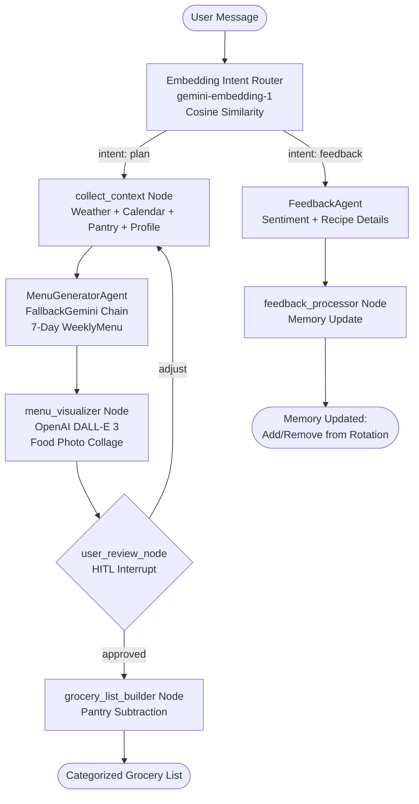

# 🍽️ Meal Concierge Multi-Agent: Family Meal & Schedule Concierge

**Meal Concierge Multi-Agent** is an AI-powered personal assistant built using **Google Agent Development Kit (ADK 2.0)**. It automates weekly meal planning and grocery shopping by intelligently balancing calendars, weather forecasts, family preferences, and long-term memory.

---

## 📖 Table of Contents
1. [Core Features](#-core-features)
2. [Architecture Overview](#️-architecture-overview)
3. [Multi-Model Strategy](#-multi-model-strategy)
4. [Workflow Graph](#-workflow-graph)
5. [Project Directory Structure](#-project-directory-structure)
6. [Prerequisites](#-prerequisites)
7. [Installation & Setup](#-installation--setup)
8. [Usage Guide](#-usage-guide)
9. [Testing & Quality Verification](#-testing--quality-verification)
10. [Changelog](#-changelog)

---

## ✨ Core Features

* **Schedules & Weather Integration**: Reads parent work events, children's sports (late dinners), and joint-custody schedules (daily headcount). Analyzes weather forecasts to determine if outdoor grilling is possible.
* **Dietary Preferences & Picky Eaters**: Automatically ignores forbidden ingredients (like shellfish or seafood) and avoids foods family members dislike.
* **Long-Term Memory Rotation**: Reads and writes favorite recipe rotations to a persistent local JSON configuration (`user_profile.json`).
* **Interactive Approval Loop (HITL)**: Proposes a menu first and allows the user to suggest adjustments or revisions before approving. Adjustments modify **only the specific requested days**, keeping all other days unchanged.
* **Smart Grocery List**: Compiles required ingredients and subtracts quantities already in the pantry/fridge to output a minimal, categorized shopping list.
* **Embedding-Based Semantic Router**: Uses `gemini-embedding-1` vector similarity (not keywords) to classify user intent as `plan` or `feedback` — understands any language and phrasing.
* **Automatic Model Fallback Chain**: Never crashes on quota errors. Automatically rotates through 6 Gemini models when the primary model is unavailable.
* **🆕 Visual Menu Preview (DALL-E 3)**: After generating the weekly menu, automatically creates a beautiful food photography collage image displayed inline in the chat before asking for approval.

---

## 🗺️ Architecture Overview

The system is composed of **3 distinct model pools** with fully isolated quotas:

```
┌─────────────────────────────────────────────────────────────┐
│  POOL 1: Embedding Router (gemini-embedding-1, RPD: 1000)   │
│  Purpose: Intent classification via cosine similarity        │
│  Completely isolated from main agent quota pool             │
└─────────────────────────────────────────────────────────────┘

┌─────────────────────────────────────────────────────────────┐
│  POOL 2: Image Generator (DALL-E 3 - OpenAI API)            │
│  Purpose: Weekly menu food photography collage               │
│  Completely isolated — does not consume LLM or embed quota  │
└─────────────────────────────────────────────────────────────┘

┌─────────────────────────────────────────────────────────────┐
│  POOL 3: Main Agents — FallbackGemini chain                 │
│  Primary: gemini-3.5-flash (RPD: 20)                        │
│  Fallback 1: gemini-3.1-flash-lite (RPD: 500) ← high quota │
│  Fallback 2: gemini-2.5-flash-lite (RPD: 20)               │
│  Fallback 3: gemini-3-flash-preview (RPD: 20)              │
│  Fallback 4: gemini-2.5-flash (RPD: 20)                    │
│  Fallback 5: gemini-2.0-flash (backup)                     │
│  Fallback 6: gemini-1.5-flash (last resort)                │
│  Timeout: 20s per model → auto-switch on slow response      │
└─────────────────────────────────────────────────────────────┘
```

### FallbackGemini Behaviour

The custom `FallbackGemini` class (extends `Gemini`) handles:
- **503 UNAVAILABLE** (high demand): Switch to next model immediately
- **429 RESOURCE_EXHAUSTED** (quota limit): Switch to next model immediately
- **20-second timeout**: If a model is slow but doesn't error, switch after 20s
- **SDK-level retries disabled** (`attempts=1`): Errors bubble up instantly so the fallback can act fast — no waiting 3–5 minutes for SDK internal retries

---

## 🔄 Workflow Graph



### Menu Adjustment Flow (HITL Loop)

When user types an adjustment (e.g. `"Change Wednesday to pasta"`):

```
user_review_node
    │
    ├─ saves adjustment text + current menu → state
    │
    └─ routes back to collect_context
                │
                ↓
        collect_context reads:
          - adjustments: "Change Wednesday to pasta"
          - previous_menu: [full 7-day menu from state]
                │
                ↓
        MenuGeneratorAgent receives BOTH
          → ONLY replaces Wednesday
          → Keeps all other 6 days identical to previous_menu
```

---

## 📂 Project Directory Structure

```
meal-concierge-agent/
├── app/
│   ├── __init__.py        # App exports
│   ├── agent.py           # ADK 2.0 workflow graph, nodes, and LLM agents
│   │                      #   - FallbackGemini class (auto model rotation)
│   │                      #   - Embedding-based semantic router
│   │                      #   - WeeklyContext + previous_menu for precise adjustments
│   ├── tools.py           # Calendar, Weather, and Pantry mock tools
│   ├── memory.py          # Long-term preference profile loader/saver
│   ├── user_profile.json  # Persistent JSON memory file (ignored by Git)
│   └── main.py            # CLI entry point (with HITL approval loop)
├── tests/
│   ├── unit/
│   │   ├── test_agent.py          # Unit tests for mock tools and subtraction logic
│   │   └── test_workflow_integration.py  # Integration tests for full workflow
│   └── eval/
│       ├── eval_config.yaml       # Quality evaluation settings
│       └── datasets/
│           └── basic-dataset.json # Evaluation dataset prompts
├── pyproject.toml         # Dependencies & project metadata
└── README.md              # Project documentation (this file)
```

---

## ⚡ Prerequisites

Before setting up, ensure you have:
* **Python 3.11** or higher.
* **uv**: Fast Python packaging tool. Install via:
  ```bash
  curl -LsSf https://astral.sh/uv/install.sh | sh
  ```

---

## 🚀 Installation & Setup

Follow these steps to set up the virtual environment and install all dependencies:

### 1. Navigate to the project directory
```bash
cd 5-days-ai-agent/capstone_project/meal-concierge-agent
```

### 2. Create the virtual environment using `uv`
Create a `.venv` folder in your project root using Python 3.11:
```bash
uv venv --python 3.11
```

### 3. Activate the virtual environment
* **On macOS/Linux:**
  ```bash
  source .venv/bin/activate
  ```
* **On Windows:**
  ```cmd
  .venv\Scripts\activate
  ```

### 4. Install dependencies
Install all the required libraries (including ADK 2.0 and evaluation dependencies) directly into the environment:
```bash
uv sync --extra eval
```

### 5. Export API Keys
Export your API keys so they are accessible to the project.
* **Gemini API Key** (Required for routing and main agents):
  ```bash
  export GEMINI_API_KEY="your_gemini_api_key_here"
  ```
* **OpenAI API Key** (Required for DALL-E 3 image generation):
  ```bash
  export OPENAI_API_KEY="your_openai_api_key_here"
  ```

---

## 💻 Usage Guide

You can run the agent either through the graphical **ADK Playground** or in your terminal via the **Interactive CLI**.

### Option A: Run the ADK Playground (Recommended)
The Playground offers a beautiful chat interface where you can see generated meal images and interact with the Human-in-the-Loop widget.

1. Ensure your virtual environment is active.
2. Launch the playground server:
   ```bash
   uv run agents-cli playground --port 8080
   ```
3. Open [http://127.0.0.1:8080](http://127.0.0.1:8080) in your browser and select the **app**.

> ⚠️ **Important**: When the workflow pauses for review (`user_review_node`), type your adjustment into the **small `Enter your response...` box** inside the HITL widget (not the main chat input bar at the bottom).

### Option B: Run the Interactive CLI
To interact with the agent directly inside the terminal:
```bash
uv run python app/main.py
```

### Test Scenarios

#### Scenario A — Meal Planning
1. Type: `Plan my weekly meals please.`
2. Wait for the 7-day menu proposal and DALL-E 3 image preview.
3. In the approval/HITL widget, type: `Change Wednesday to pasta`
4. The system will regenerate **only** Wednesday's meal, keeping the rest intact.
5. Type `yes` to approve → view the final categorized grocery list.

#### Scenario B — Recipe Feedback (Positive)
Type any of these in the chat:
```
We loved the Spaghetti Bolognese last night!
The grilled chicken was amazing, please save it to favorites.
```
Expected: `[Memory Update] Added 'X' to your family favorites rotation.`

#### Scenario C — Recipe Feedback (Negative)
```
I hated the pizza, it was way too greasy.
The fish dish was terrible, please remove it.
```
Expected: `[Memory Update] Removed 'X' from your family favorites rotation.`

> 💡 The Embedding Router uses semantic vector similarity to route your feedback correctly without requiring strict keywords!

---

---

## 🛠️ Testing & Quality Verification

### Run Unit Tests (`pytest`)
```bash
uv run pytest tests/unit/
```

### Run Systematic LLM Evaluations
```bash
~/.local/bin/agents-cli eval run
```
Runs scenarios in `basic-dataset.json`, grades trace outcomes, and generates scores based on constraint adherence rules in `eval_config.yaml`.

---

## 📝 Changelog

### v2.0.0 — June 2026 (Current)

#### 🆕 New: Visual Menu Preview — OpenAI DALL-E 3
- Added `menu_visualizer` node between `MenuGeneratorAgent` and `user_review_node`
- Calls OpenAI DALL-E 3 API (`dall-e-3`) — **3rd isolated quota pool (using `OPENAI_API_KEY`)**
- Generates 1 high-quality food photography image representing all 7 meals
- Displays inline in Playground chat with caption before asking user to approve
- **Graceful fallback**: if OpenAI API quota is exhausted or API error, skips image with a note and continues workflow normally — never blocks the meal planning flow

#### 🆕 New: Embedding-Based Semantic Router
- **Replaced** keyword-based `user_query_router` with `embedding_intent_router`
- Uses `gemini-embedding-1` API (RPD: 1,000) — **50× more quota** than LLM router
- Computes cosine similarity between user query and pre-cached centroid embeddings
- Reference centroids computed **once at startup**, cached for all subsequent calls
- **Fallback**: graceful degradation to keyword matching if Embedding API is unavailable
- Understands any phrasing, multilingual, positive/negative sentiment context

#### 🆕 New: FallbackGemini — Automatic Model Rotation
- Custom `FallbackGemini` class extends ADK's `Gemini`
- **7-model fallback chain**: gemini-3.5-flash → gemini-3.1-flash-lite → gemini-2.5-flash-lite → gemini-3-flash-preview → gemini-2.5-flash → gemini-2.0-flash → gemini-1.5-flash
- **20-second per-model timeout**: Never hangs on slow models
- **SDK retries disabled** (`attempts=1`): Errors surface instantly so fallback triggers immediately
- Covers: 503 UNAVAILABLE, 429 RESOURCE_EXHAUSTED, 404 NOT_FOUND, asyncio.TimeoutError

#### 🆕 New: Precise Menu Adjustment (HITL Loop Fix)
- `WeeklyContext` now includes `previous_menu` field
- When user requests adjustment, `collect_context` reads `state["current_menu"]` and passes it to `MenuGeneratorAgent`
- Prompt explicitly instructs LLM to **only modify the requested day(s)**, keeping all other days identical
- Fixed: previously LLM would regenerate the entire menu from scratch on adjustments

#### 🐛 Fixed: ValidationError on Adjust Route
- `user_review_node` was passing `WeeklyMenu` object (not `str`) to `collect_context`
- Fixed: adjusted branch now passes `response` (user's text string) as `output`
- `collect_context` signature updated to `node_input: Any` for flexibility

#### 🏗️ Architecture: Isolated Quota Pools
- Router quota completely separated from main agent quota
- `router_model` uses plain `Gemini` (not `FallbackGemini`) to prevent cross-pool interference

### v1.0.0 — June 2026 (Initial)
- Core ADK 2.0 workflow with `@node` decorators
- `MenuGeneratorAgent` with `WeeklyMenu` structured output
- `FeedbackAgent` with sentiment classification
- `grocery_list_builder` with pantry subtraction
- HITL `user_review_node` with `ResumabilityConfig`
- Mock tools: `get_weather_forecast`, `get_family_calendar`, `get_pantry_inventory`
- Long-term memory: `add_recipe_to_rotation`, `remove_recipe_from_rotation`
